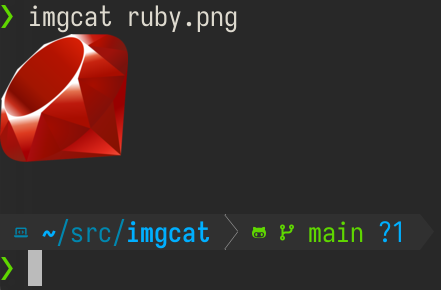

# Imgcat



Display images in modern supported terminals

Currently this supports only the [iterm2 inline image protocol](https://iterm2.com/documentation-images.html).
I'm open to adding more formats (sixel, kitty). PRs accepted.

Supported:
* wezterm
* iterm2
* [vscode](https://code.visualstudio.com/updates/v1_80#_image-support) (untested)
* rlogin (untested)
* mlterm (untested)
* mintty (untested)
* tmux (nested inside another supported terminal)

Theoretically supportable:
* kitty (uses bespoke protocol, unimplemented)
* xterm (sixel, unimplemented)
* foot (sixelm, unimplemented)

Unsupportable (get a better terminal):
* alacritty

## Installation

Install the gem and add to the application's Gemfile by executing:

    $ bundle add imgcat

If bundler is not being used to manage dependencies, install the gem by executing:

    $ gem install imgcat

## Usage

Command line:
```
imgcat ruby.png
```

Ruby:
``` ruby
image = File.read("ruby.png")
Imgcat.new.display(image)
```

## Development

After checking out the repo, run `bin/setup` to install dependencies. Then, run `rake test` to run the tests. You can also run `bin/console` for an interactive prompt that will allow you to experiment.

To install this gem onto your local machine, run `bundle exec rake install`. To release a new version, update the version number in `version.rb`, and then run `bundle exec rake release`, which will create a git tag for the version, push git commits and the created tag, and push the `.gem` file to [rubygems.org](https://rubygems.org).

## Contributing

Bug reports and pull requests are welcome on GitHub at https://github.com/jhawthorn/imgcat. This project is intended to be a safe, welcoming space for collaboration, and contributors are expected to adhere to the [code of conduct](https://github.com/jhawthorn/imgcat/blob/main/CODE_OF_CONDUCT.md).

## License

The gem is available as open source under the terms of the [MIT License](https://opensource.org/licenses/MIT).

## Code of Conduct

Everyone interacting in the Imgcat project's codebases, issue trackers, chat rooms and mailing lists is expected to follow the [code of conduct](https://github.com/jhawthorn/imgcat/blob/main/CODE_OF_CONDUCT.md).
